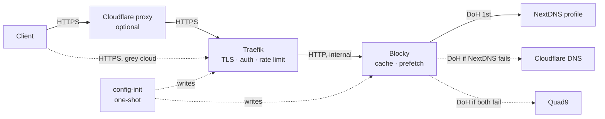

# Dokploy-Private-DoH

> Password-protected DNS-over-HTTPS with caching and strict upstream failover — for Dokploy and Traefik v2.11+ / v3.

Run your own DoH endpoint (`https://resolver.example.com/dns-query`) that only you can use. Queries go to **your NextDNS profile first**. If NextDNS fails, they go to Cloudflare, then Quad9. Every hop that leaves the server is encrypted. It deploys as a Dokploy compose app and is configured entirely from the Environment tab.

**Author:** Ali Rajabpour Sanati — [Rajabpour.com](https://rajabpour.com)

---

## Contents

1. [Why](#why)
2. [Features](#features)
3. [Architecture](#architecture)
4. [Requirements](#requirements)
5. [Quick start (Dokploy)](#quick-start-dokploy)
6. [Configuration](#configuration)
7. [Client setup](#client-setup)
8. [Verifying the endpoint](#verifying-the-endpoint)
9. [Cloudflare proxy (orange cloud)](#cloudflare-proxy-orange-cloud)
10. [Performance and failover](#performance-and-failover)
11. [Security and threat model](#security-and-threat-model)
12. [Upgrading from the dnscrypt-proxy / Unbound version](#upgrading-from-the-dnscrypt-proxy--unbound-version)
13. [Development](#development)
14. [FAQ](#faq)
15. [License](#license)

---

## Why

Public DoH resolvers are either open to everyone or tied to one provider. This project gives you:

- **One private endpoint for every device and OS.** Change upstreams once on the server instead of on every client.
- **Real failover.** NextDNS is always tried first. Cloudflare and Quad9 are used only when NextDNS fails. Most clients accept only one custom DoH server, so they cannot do this on their own.
- **A shared cache.** Popular names are prefetched before they expire.
- **Your client IP stays hidden from the upstream.** NextDNS sees your server's IP, not your home or mobile IP.
- **Harder to block.** Your own domain is harder to block than well-known resolver hostnames. It is harder still behind Cloudflare.

What it does **not** give you: more privacy from your upstream. NextDNS still sees every query, and your profile ties those queries to you. See [Security and threat model](#security-and-threat-model).

## Features

- **Two auth methods, use either or both**
  - **Secret path** — `https://resolver.example.com/dns-query/<secret>`. Works in every DoH client, including ones with no username/password fields.
  - **HTTP Basic Auth** — for clients with username and password fields.
- **Strict upstream order** — Blocky `strategy: strict`: NextDNS, then Cloudflare, then Quad9, each tried only if the previous one fails or times out (1 s).
- **Encrypted everywhere** — client → Traefik is HTTPS. Server → upstreams is DoH. Even the bootstrap lookups use DoH to an IP address.
- **Cache with prefetching** — upstream TTLs are respected, with no forced minimums.
- **Rate limiting** — per real client behind Cloudflare (`CF-Connecting-IP`, trusted only because of mTLS).
- **Cloudflare orange-cloud mode** — the origin completes TLS only for Cloudflare (Authenticated Origin Pulls / mTLS). Direct hits on the server IP fail the handshake.
- **Your choice of certificate** — Let's Encrypt, or a certificate you already added (for example a Cloudflare Origin Certificate).
- **Minimal attack surface**
  - The internet-facing resolver runs as non-root on a scratch image.
  - Only a one-shot init container, never reachable from the internet, writes Traefik's config.
  - Plain DNS listens on loopback only.
- **No `$` escaping** — bcrypt hashes are read straight from `.env`, so Docker Compose never mangles them.
- **Fails loudly** — invalid or missing settings stop the deploy with a clear error instead of starting an open resolver.

## Architecture



| Service | Image | Role |
| --- | --- | --- |
| `config-init` | `busybox` | Reads and validates `.env`, writes the Blocky config and the Traefik dynamic config, then exits. No network. |
| `blocky` | `spx01/blocky` | Serves DoH on internal port 4000. Caches, prefetches, and forwards to the upstreams in strict order. |

Why DoH upstreams instead of DoT (port 853)? Many VPS providers block outbound 853. DoH uses 443, which is virtually never blocked.

## Requirements

- **Dokploy** — or any **Traefik v2.11+ or v3** that uses a file provider directory mounted at the same path inside the container. See the Traefik variables in [Configuration](#configuration).
- A DNS A record for `resolver.<your-domain>` pointing to the server. Add AAAA only if the server has IPv6. Behind the Cloudflare proxy, clients get Cloudflare's IPv6 addresses either way.
- Optional: a [NextDNS](https://nextdns.io) profile.
- `htpasswd` (macOS built-in; `apache2-utils` on Debian/Ubuntu) and `openssl` to generate credentials.

## Quick start (Dokploy)

1. **Create a Compose app** in Dokploy. Source: this repository, compose file `docker-compose.yml`.
2. **Generate credentials** on your own machine:

   ```bash
   # Secret path (works with every client)
   openssl rand -hex 24

   # Basic Auth (optional). Copy the part after "myuser:"
   htpasswd -nbB myuser 'a-long-random-password'
   ```

3. **Environment tab** — paste the contents of [`env-example`](env-example) and fill in `DOMAIN`, `DOH_SECRET_PATH` and/or `DOH_USER` + `DOH_HASHED_PASS`, and `NEXTDNS_ID`. Each variable is explained in the file.
4. **Deploy.** Check the `config-init` logs. It prints the endpoint, the enabled auth methods, the Cloudflare mode, the certificate source and the upstream order, or a clear error.
5. **Test** with [Verifying the endpoint](#verifying-the-endpoint).

Without Dokploy: `cp env-example .env`, edit it, set the Traefik variables, and make sure the external network in `docker-compose.yml` matches your Traefik network. Then run `docker compose up -d`.

## Configuration

All settings live in `.env` (the Dokploy Environment tab). [`env-example`](env-example) is the reference, with a how-to for each one.

| Variable | Default | Description |
| --- | --- | --- |
| `DOMAIN` | — | Apex domain. The endpoint is `<DOH_SUBDOMAIN>.<DOMAIN>`. |
| `DOH_SUBDOMAIN` | `resolver` | Subdomain label. |
| `DOH_SECRET_PATH` | — | 24+ chars `[A-Za-z0-9_-]`. Enables `/dns-query/<secret>`. |
| `DOH_USER` / `DOH_HASHED_PASS` | — | Basic Auth user and **bcrypt hash**. No escaping, no quotes needed. |
| `NEXTDNS_ID` | — | NextDNS profile ID. Queried first. |
| `FALLBACK_UPSTREAMS` | Cloudflare, Quad9 | Comma-separated. `https://…` (DoH), `tcp-tls:host` (DoT), `quic:host` (DoQ). |
| `CLOUDFLARE_PROXY` | `false` | `true` when the record is orange-clouded. Requires Authenticated Origin Pulls in Cloudflare. |
| `TRAEFIK_ENTRYPOINT` | `websecure` | Traefik HTTPS entrypoint name. |
| `TRAEFIK_CERT_RESOLVER` | `letsencrypt` | ACME resolver name. **Empty** = use an existing certificate (e.g. Cloudflare Origin cert from Dokploy's Certificates UI). |
| `TRAEFIK_DYNAMIC_DIR` | `/etc/dokploy/traefik/dynamic` | Host directory watched by Traefik's file provider. |

At least one auth method must be set, or the deploy fails.

Cache, logging and bootstrap settings are in [`blocky.yml`](blocky.yml). The `upstreams:` section is generated from `.env` on every deploy. A redeploy restarts Blocky only when its generated config changes, so auth-only changes cause no DNS interruption.

**Plaintext vs hash:** `.env` holds the **hash** (`$2y$…`). Clients get the **plain password**. Putting the hash into a client always returns 401.

## Client setup

Use the secret-path URL wherever a client has only a URL field:

```text
https://resolver.example.com/dns-query/<DOH_SECRET_PATH>
```

Use Basic Auth where a client has username and password fields: URL `https://resolver.example.com/dns-query`, plus username and the **plain** password.

| Client | Method | Notes |
| --- | --- | --- |
| **YogaDNS** (Windows) | Secret path or Basic Auth | Add a custom DoH server. Tested. |
| **Little Snitch 6.1.3+** (macOS) | Secret path or Basic Auth | Settings → DNS Encryption → Custom → DNS over HTTPS. Tested. |
| **Windows 11** native | Secret path | Settings → Network → DNS → Encrypted (manual template). |
| **Firefox** | Secret path | Settings → Privacy & Security → DNS over HTTPS → Custom. |
| **Chrome / Edge / Brave** | Secret path | Settings → Security → Use secure DNS → Custom. |
| **iOS / macOS profile** | Secret path | A `.mobileconfig` with a `DNSSettings` payload, `DNSProtocol` = `HTTPS`, `ServerURL` = the secret-path URL. |
| **Android apps** (Intra, Rethink DNS, …) | Secret path | Android's built-in "Private DNS" is DoT only and cannot use this. |
| **curl** | Either | See below. |

Rows not marked "Tested" follow the client's documented DoH support but have not been verified with this project. Please open an issue with results.

Troubleshooting:

- **401** — you entered the bcrypt hash instead of the plain password, or the username is wrong.
- **404** — wrong secret path, or the Host/path doesn't match `DOMAIN` / `DOH_SUBDOMAIN`.
- **403 / challenge page** — a Cloudflare security feature is blocking the client (see [Cloudflare](#cloudflare-proxy-orange-cloud)).
- **525/526 or handshake failure** — `CLOUDFLARE_PROXY=true` but Authenticated Origin Pulls is off in Cloudflare (or the record is grey).
- **429** — rate limit hit (50 req/s, burst 200). This is per client with `CLOUDFLARE_PROXY=true`. Without Cloudflare, Dokploy's Swarm ingress hides client IPs from Traefik, so the limit is shared by all clients.

## Verifying the endpoint

`AAABAAABAAAAAAAAB2V4YW1wbGUDY29tAAABAAE` is a base64url DNS wire-format query for `example.com A`.

```bash
Q='dns=AAABAAABAAAAAAAAB2V4YW1wbGUDY29tAAABAAE'
H='https://resolver.example.com'

# Secret path → 200
curl -s -o /dev/null -w '%{http_code}\n' -H 'accept: application/dns-message' "$H/dns-query/<DOH_SECRET_PATH>?$Q"

# Basic Auth → 200
curl -s -o /dev/null -w '%{http_code}\n' -H 'accept: application/dns-message' -u 'myuser:plain-password' "$H/dns-query?$Q"

# No credentials → 401 (Basic Auth enabled) or 404 (secret path only)
curl -s -o /dev/null -w '%{http_code}\n' "$H/dns-query?$Q"

# Wrong secret → 401 / 404
curl -s -o /dev/null -w '%{http_code}\n' "$H/dns-query/wrong?$Q"
```

To confirm NextDNS answers: open the NextDNS dashboard → Logs while you run a query. With `dig` 9.18+: `dig @resolver.example.com +https=/dns-query/<secret> example.com`.

To test the config renderer locally: `sh tests/render-test.sh`.

## Cloudflare proxy (orange cloud)

Proxying hides the server behind Cloudflare. **Cloudflare terminates TLS, so it sees every DNS query and the credentials** (the secret path and the Basic Auth password). No auth scheme avoids that. You are choosing to trust Cloudflare in exchange for hiding the origin.

**Why mTLS instead of an IP allowlist:** Dokploy publishes Traefik through Docker Swarm's ingress mesh, which rewrites every client address to an internal `10.0.0.x`. Traefik never sees Cloudflare's IPs, so an allowlist would block everyone. Authenticated Origin Pulls checks a client certificate that only Cloudflare presents, and that works regardless of addresses.

Setup:

1. Move the domain's DNS to Cloudflare with every record **DNS only (grey)** first. Confirm everything still works.
2. **SSL/TLS → Overview → Full (strict).**
3. **Certificate:** either keep `TRAEFIK_CERT_RESOLVER=letsencrypt`, or create a Cloudflare Origin Certificate (SSL/TLS → Origin Server), add it in Dokploy → Settings → Certificates, and set `TRAEFIK_CERT_RESOLVER=` (empty). The Origin certificate lasts up to 15 years and needs no HTTP-01 renewals. Clients that bypass Cloudflare also don't trust it, which is a bonus. If you switch from Let's Encrypt, Traefik keeps serving the old exact-name certificate from `acme.json` (an exact name beats a wildcard). Remove that entry and restart Traefik to switch over.
4. **SSL/TLS → Origin Server → Authenticated Origin Pulls → On.** This applies zone-wide. Other origins that don't ask for the certificate are unaffected.
5. Turn the `resolver` record **Proxied (orange)**.
6. Set `CLOUDFLARE_PROXY=true` and redeploy. Test: through Cloudflare → 200. Directly to the server IP (`curl --resolve resolver.example.com:443:<server-ip> …`) → TLS handshake error.
7. **Security → WAF → Custom rules:** *Hostname equals `resolver.example.com`* → **Skip** all remaining custom rules, rate limiting, managed rules, Browser Integrity Check, Security Level and Bot Fight Mode. This is required, not optional: Cloudflare's default checks return 403 to some non-browser user agents (for example Python's `urllib`), and DoH clients cannot solve challenges.

Recommended zone settings (all verified working with this project):

| Setting | Value | Why |
| --- | --- | --- |
| DNS → DNSSEC | Enabled, DS added at the registrar | Signed answers for your domain. Check with `dig +dnssec resolver.example.com @1.1.1.1` (look for the `ad` flag). |
| SSL/TLS → Edge Certificates → Minimum TLS | 1.2 | Drops legacy TLS. |
| TLS 1.3 | On | Faster handshakes. |
| 0-RTT Connection Resumption | Off | 0-RTT data can be replayed. |
| Speed → HTTP/3 (QUIC) | On | Faster client → Cloudflare connections on lossy networks. |
| Always Use HTTPS | On only with a Cloudflare Origin cert | With Let's Encrypt HTTP-01 it breaks renewals (see below). |
| HSTS | Leave off unless you understand it | It applies zone-wide and is hard to undo. |

With Let's Encrypt, leave **Always Use HTTPS** off, or exempt `/.well-known/acme-challenge/*`, so HTTP-01 renewals still reach Traefik.

Limits:

- Zone-level Authenticated Origin Pulls uses a certificate shared by all Cloudflare customers. It proves "this came through Cloudflare", not "through *your* zone". Auth still protects the endpoint. Per-hostname AOP with your own certificate closes that gap.
- The origin IP stays hidden only if **every** record pointing at the server is proxied. Passive-DNS databases also keep old records: if a record was ever grey, its IP is already on file.
- The bundled `cloudflare-origin-pull-ca.pem` expires **2029-11-01**. Replace it from <https://developers.cloudflare.com/ssl/origin-configuration/authenticated-origin-pull/set-up/zone-level/> before then.

## Performance and failover

Measured on 2026-09-30. Client in the Middle East entering Cloudflare at Muscat, server in the Netherlands, Cloudflare proxy + mTLS on. Each query used a new TLS connection. Real clients keep HTTP/2 connections open, so they see less.

| Path | Median per query |
| --- | --- |
| This endpoint (via Cloudflare → Traefik → Blocky → NextDNS) | **182 ms** |
| NextDNS profile endpoint directly from the same client | 862 ms |
| `cloudflare-dns.com` directly from the same client | blocked (connection reset) |

- Almost all of the 182 ms is the client → Cloudflare → server network path. Blocky → NextDNS takes about 10 ms from the server.
- The biggest win is on networks that throttle or block public DoH endpoints. Your own domain behind Cloudflare looks like any other website.

**Failover, verified:** outbound traffic from the Blocky container to NextDNS was dropped with a temporary firewall rule, then queries were sent through the endpoint.

| | Random `*.doubleclick.net` name | Answered by |
| --- | --- | --- |
| NextDNS reachable | NextDNS block page, ~190 ms | NextDNS profile |
| NextDNS dropped | NXDOMAIN (unfiltered), ~2.2 s | Cloudflare fallback |

The 2.2 s is two 1 s upstream timeouts before the fallback answers. It applies only to uncached names while NextDNS is down. Cached names stay instant.

## Security and threat model

| Party | What they see |
| --- | --- |
| Your network / ISP | TLS to your domain (or to Cloudflare). Not the queries. |
| Cloudflare (orange cloud only) | Every query, the credentials, your client IP. |
| Your server / VPS provider | Queries in memory. No query log is written (`queryLog.type: none`), and other log lines mask domain names (`log.privacy: true`). |
| NextDNS / fallback upstream | Every query, and your **server's** IP, not your client IP. Your NextDNS profile links the queries to your account. |

Design choices and limits:

- **Credentials.** The secret path is 96+ bits of randomness and cannot be guessed. A Basic Auth password is only as strong as you make it. The rate limit slows guessing but does not stop it, so use a long random password.
- **Certificate Transparency.** Your hostname appears in public CT logs as soon as a certificate is issued. The auth is what protects the endpoint, not an obscure hostname.
- **Neighbour containers.** Blocky's HTTP port (4000) can be reached by other containers on the shared Traefik network (`dokploy-network`). Plain DNS is loopback-only.
- **DNSSEC.** Blocky does not validate signatures itself. It relies on the upstream (NextDNS, Cloudflare and Quad9 all validate). Enable `dnssec.validate` in `blocky.yml` if you want local validation, at the cost of extra upstream lookups.
- **During failover** your NextDNS blocklists and settings don't apply. Uncached queries also wait about 2 s (two 1 s timeouts) for NextDNS to time out.
- **Geo answers.** CDNs pick servers near your **server**, not near you. Host the server close to where you are.

Report security issues privately via [GitHub Security Advisories](https://github.com/ali-rajabpour/Dokploy-Private-DoH/security/advisories/new).

## Upgrading from the dnscrypt-proxy / Unbound version

The old `doh-server`, `unbound` and `dnscrypt-proxy` services are gone. Docker Compose does not remove containers for services that no longer exist. **Remove them**, or the old `doh-server` may restart after a reboot and overwrite the Traefik config:

```bash
# In the app's directory on the server (Dokploy: .../compose/<app>/code)
docker compose up -d --remove-orphans
```

Or stop and delete the three old containers in Dokploy. Then update the Environment tab from `env-example`:

- `DOH_SERVER_LISTEN` and `DOH_HTTP_PREFIX` are no longer used.
- `NEXTDNS_ID` and `DOH_SECRET_PATH` are new.

## Development

- `sh tests/render-test.sh` renders sample configs and checks them, including rejection of invalid input. It runs with any POSIX `sh` and needs no Docker.
- Blocky reads its config only at startup. When you change `blocky.yml` or the upstreams section of `config-init.sh`, bump `CONFIG_REV` in `docker-compose.yml`, so the next deploy restarts Blocky.
- The Cloudflare origin-pull CA is `cloudflare-origin-pull-ca.pem` (public, expires 2029-11-01).

## FAQ

**How do I change the upstreams?** Set `NEXTDNS_ID` and `FALLBACK_UPSTREAMS`, then redeploy.

**How do I rotate credentials?** Generate a new secret or hash, update the Environment tab, and redeploy. The old value stops working immediately. Rotate `DOH_SECRET_PATH` too: it is a credential, not just a URL.

**Where are the logs?**
- `docker compose logs config-init` — rendered endpoint, auth methods and upstream order, or validation errors.
- `docker compose logs -f blocky` — resolver logs. No per-query lines are logged.

**Can I add blocklists?** Blocky supports them (`blocking:` in `blocky.yml`), but NextDNS already does this per profile. Keep blocking in one place.

**How do I update?** Pull the repository and redeploy. Image versions are pinned in `docker-compose.yml`. Bump them deliberately after reading the release notes.

## License

MIT — see [LICENSE](LICENSE).
